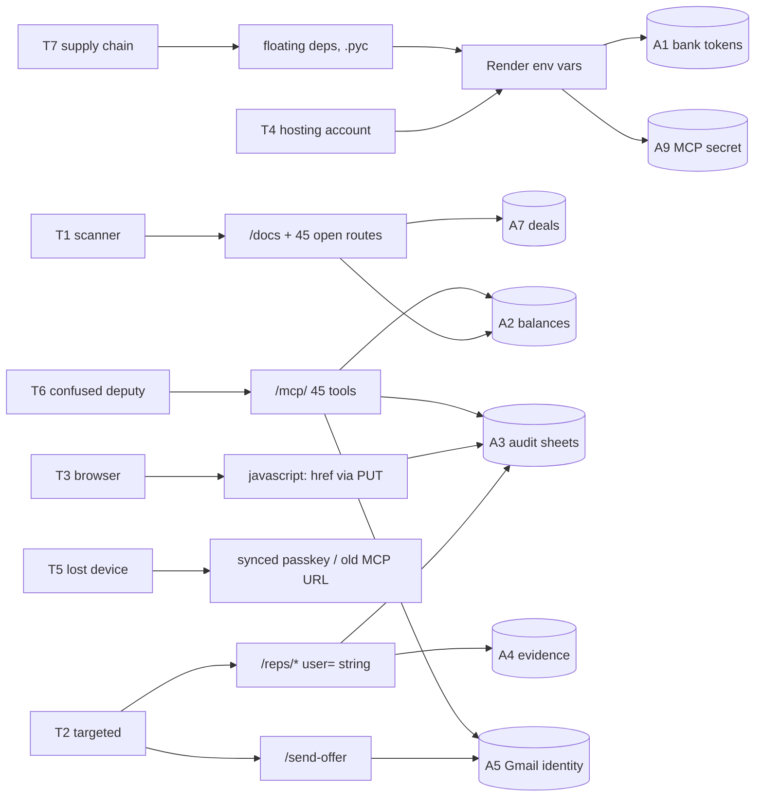
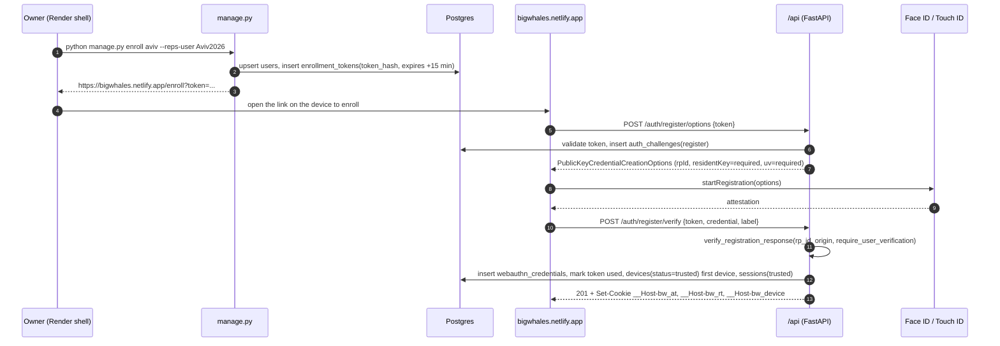
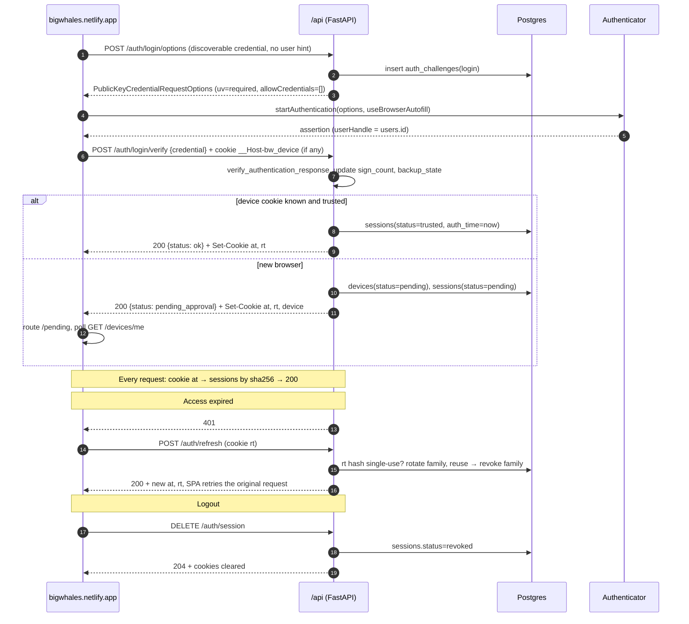
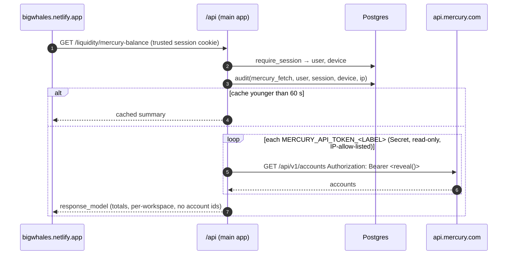
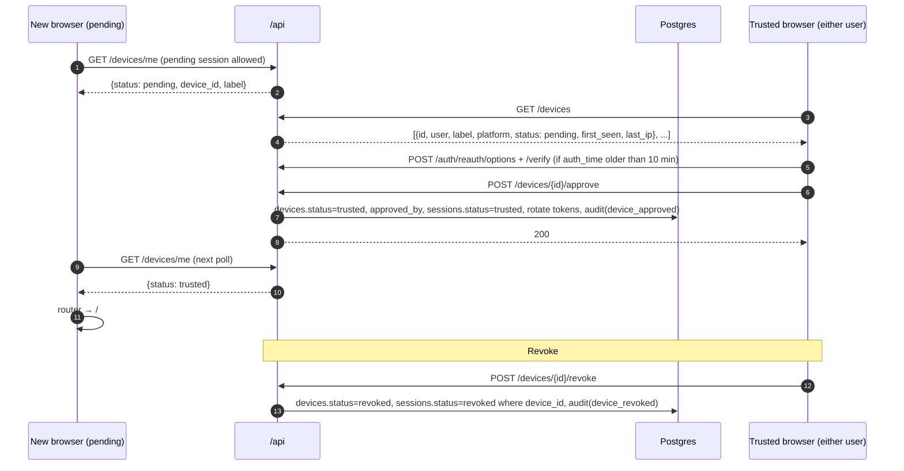
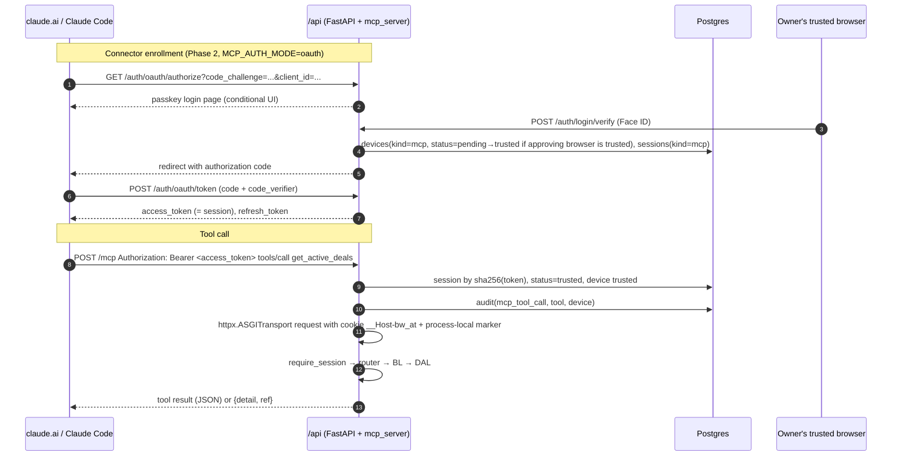

# BigWhales · Security Audit & Execution Plan

**Scope:** the whole repository at `main` `99d7d0b` — FastAPI backend (`BackEnd/`), Vue 3 SPA (`frontend/`), PostgreSQL, the MCP server (`BackEnd/mcp_server.py`), CI/nightly workflows, deployment on Render + Netlify, and the Mercury / Gmail / Google Sheets + GCS integrations.
**Method:** Trail of Bits skills (`insecure-defaults`, `sharp-edges`, `entry-point-analyzer`, `vulnerability-triage-brocards`, `supply-chain-risk-auditor`, `static-analysis`) from [trailofbits/skills](https://github.com/trailofbits/skills), applied as manual code review with `file:line` evidence, plus a git-history sweep of all 199 commits.
**Status:** design and roadmap only. No implementation code is included or changed by this document.

---

## 0. Read this first

### 0.1 Executive summary

- **Posture today: Critical.** Forty-five HTTP routes, and every one of them as an MCP tool, are reachable with **no authentication or authorization**. The data model is single-tenant, there is no rate limiting, no request-size limit and no security headers. The CORS allow-list is not access control (a `curl` ignores it), and `/docs` publishes the full route map.
- **The three most valuable assets are the three most exposed:** live Mercury bank balances (`GET /liquidity/mercury-balance`), the IRS-audit REPS spreadsheets and evidence bucket (client-chosen `user=` string, anonymous upload, world-readable objects by default, formula injection), and the LLC's Gmail identity (`POST /send-offer` is an open relay with HTML injection).
- **The new MCP server raises the stakes:** it exposes those same capabilities to an LLM behind a secret embedded in the URL, fails open to `/mcp` when the secret is unset, and, because tool calls re-enter the app in-process, it would silently break under a naive authentication rollout.
- **What is genuinely good, stated plainly:** ORM everywhere (no SQL injection); no `eval`/`exec`/`pickle`/`subprocess`; ReportLab builds PDFs in memory (no SSRF); upload names are rebuilt server-side (no path traversal); the Mercury token is never stored, logged or returned and is read per request; the test harness has hard database isolation and scrubs every credential; CI runs with `permissions: contents: read`, no `pull_request_target`, no secret echo; nothing secret in git history or in the JavaScript bundle.
- **Strategy:** Phase 0 (≈1.5 days) stops the bleeding with no architecture change; Phase 1 (≈1 week) isolates secrets and closes the critical bugs; Phase 2 (≈3 weeks) adds passkeys, sessions and an OAuth-secured MCP connector; Phase 3 (≈2 weeks) adds device allowlisting, the admin dashboard and CI gates. Every gate ships behind an environment flag with a shadow (log-only) mode first, and every step lists its tests and its rollback.

### 0.2 Hard invariant: zero functional regression

Every feature that works today keeps working after every phase. The plan is **additive**: no route is removed or renamed, no response shape changes, no calculation changes. The security layer is a gate *in front of* the existing routes. The only user-visible additions are:

1. a one-time enrollment and a login screen (Face ID / Touch ID);
2. a "this device is pending approval" state the first time a new browser is used;
3. a biometric prompt when sending an offer, approving a device, or adding a passkey;
4. a one-time re-add of the claude.ai connector when the MCP endpoint moves to OAuth (Phase 2).

Where a naive fix would remove behaviour, this plan does something else:

| Feature today | Naive fix that would break it | What this plan does instead |
| --- | --- | --- |
| Either partner can open either REPS tab (Aviv / Yarden) and log for it | Derive the user from the session and forbid the other tab | Keep the tab selector exactly as is; require an authenticated, trusted-device session on every `/reps/*` route; record *who* (session user) logged *for whom* (tab) in the audit table, optionally as a new trailing Sheet column so existing columns keep their positions |
| The CPA / IRS open evidence links from the Sheet without a Google login | Flip `REPS_LINK_STYLE` to `auth` | Keep permanent login-free links; close the *enumeration* hole instead: `allUsers` gets `roles/storage.legacyObjectReader` (get, **no list**) instead of `objectViewer`; object names get a 16-hex random suffix so URLs are unguessable capability URLs; uploads require a session. Switching to `auth` or `signed` stays an explicit owner choice (O-6), off by default |
| Offer e-mail from `BigWhalesLLC@gmail.com` with the branded HTML template | A recipient allow-list | Same template, sender and one-click flow; add `EmailStr` validation, HTML-escape the interpolated fields (visually identical for real names and addresses), session + step-up, and a generous rate limit (30 per hour) |
| Sheet cells: `Total Hours` numeric, `Material Participation` TRUE/FALSE, evidence cell with rich-text links | `valueInputOption="RAW"` everywhere (would stringify numbers and booleans) | Send typed JSON values (`float`, `bool`) with `RAW` so they stay typed; only free-text cells change, and only by gaining a leading `'` when they start with `=`, `+`, `-` or `@`; rich-text links come from the separate `updateCells` call, unchanged |
| The Liquidity page auto-loads the Mercury balance on open | Biometric step-up on `/liquidity/mercury-balance` | No step-up there (it would prompt on every page open); protection is the trusted-device session, an audit row per fetch and a 60-second cache |
| **All 45 MCP tools work from claude.ai and Claude Code** | Put auth on the routers and forget the in-process tool calls (every tool would return 401) | The connector becomes an approved *device* with its own session; tool calls carry that session on the in-process request; `MCP_SCOPES` defaults to all tools. The path-secret mode stays as a flag until the OAuth mode is proven |
| `/docs` used locally; `localhost` CORS origins for development | Disable / remove them | Only when `APP_ENV=production`; unchanged in development |
| Deep links, four looks, mobile layout, autosave, drag, PDF, duplicate/delete, send offer | — | Untouched; proven by the existing Playwright matrix, network goldens and `verify_regression.py` running *through* the login gate with a virtual authenticator |

### 0.3 How zero regression is guaranteed

1. **Additive only.** Authentication is a FastAPI dependency attached at `include_router` time in `BackEnd/main.py`. Routers, business logic, DAL, calculators, the PDF builder and the existing views are not edited. New behaviour lives in new files. Where an existing file must change (12 `:href` sites, `EmailStr`, the Sheet append, five log lines), the change is a one-line wrap plus a test asserting byte-identical output for normal input.
2. **Shadow mode before enforcement.** Every gate has a flag: `APP_KEY_REQUIRED`, `AUTH_ENFORCE`, `DEVICE_POLICY`, `MCP_AUTH_MODE`, and CSP in report-only. In shadow mode the gate logs what it *would* have blocked and lets the request through. The owners use the product normally for a few days; the log is read; the flag is flipped to enforce only when the log holds no surprises. Rollback is flipping the flag back, with no code deploy.
3. **The repository's own proof harness runs on every phase.** `verify_regression.py verify` compares the OpenAPI shape, the schema, the calculations and every endpoint's response bit-for-bit against committed snapshots; the Playwright flows replay recorded network goldens against the real backend; `npm run verify:ui` runs the visual and accessibility gates; the 88 MCP tests exercise all 45 tools. Rule for every pull request: all of these stay green, and the only snapshot allowed to change is the OpenAPI one, once, deliberately, to add the auth routes and the 401 response. The test harness gains a shared `seed_trusted_session()` helper and a virtual authenticator so the *existing* flow specs pass through the login gate unmodified.
4. **Feature inventory checklist** (§5.5): one row per feature with the test that proves it.
5. **Small pull requests, one flag each,** so any regression is a single revert.

What honestly changes: anonymous callers get `401`; a login and a device-approval screen appear; a genuine server error returns `internal error` plus a reference id instead of raw exception text; a REPS free-text cell that starts with `= + - @` gains a leading apostrophe; the browser console stops printing full deal payloads in production. Nothing else in the product's outputs moves.

### 0.4 Decisions already taken with the owner

| # | Decision | Choice |
| --- | --- | --- |
| O-1 | Domain | Stay on `bigwhales.netlify.app`; make the API same-origin with a Netlify `/api/*` rewrite; WebAuthn RP ID = `bigwhales.netlify.app` (a later move to a custom domain means both users re-enroll their passkeys, about ten minutes) |
| O-2 | Sign in with Apple | Optional recovery path only (Phase 2b); passkeys are the login |
| O-3 / O-4 | Mercury secrets | Phase 1 controls only (read-only tokens, IP allow-list, in-memory hygiene, audit); the token-broker and Secret-Manager designs are kept as an appendix |

Defaults applied unless the owner says otherwise: **O-5** session lifetimes 15 min access / 30 days refresh · **O-6** keep public evidence links · **O-7** both users may approve devices · **O-8** `MCP_SCOPES` = all 45 tools.

---

## 1. Threat model

### 1.1 Asset classification

| ID | Asset | Class | Where it lives | Exposure today |
| --- | --- | --- | --- | --- |
| A1 | Mercury API tokens `MERCURY_API_TOKEN_*` | **Crown jewel** — bank access | Render environment; scanned from `os.environ` per request | Plaintext in the hosting dashboard |
| A2 | Live balances, account ids, workspace labels | Confidential financial | `GET /liquidity/mercury-balance`; MCP tool `get_mercury_balance` | Anonymous internet |
| A3 | REPS tax-audit sheets (hours, descriptions, **GPS breadcrumbs**, people) | Legal record + PII | Google Sheets via the service account | Anonymous read and append via `?user=` |
| A4 | REPS evidence files (photos, closing documents) | PII / legal | GCS bucket, `public` link style by default | World-readable permanent URLs; anonymous upload |
| A5 | Gmail app password and the `BigWhalesLLC@gmail.com` sender identity | Credential + reputation | Render environment; hard-coded sender | Open relay; two characters and the length written to logs |
| A6 | Google service-account key JSON | Credential (`cloud-platform` scope, project-wide `objectAdmin`) | Render secret file | Over-scoped |
| A7 | Deal pipeline (addresses, prices, agent e-mails, comps, notes) and the liquidity plan | Business confidential | PostgreSQL | Anonymous full CRUD |
| A8 | `DATABASE_URL` | Credential | Render environment | No `sslmode` enforced |
| A9 | `MCP_PATH_SECRET` | Credential — equals A2–A7 combined | Render environment; **the URL path of every MCP request** | Access logs, connector configs |
| A10 | GitHub repository and Actions secrets (`NIGHTLY_MAIL_*`) | Supply chain | GitHub | Reasonable; actions tag-pinned |

### 1.2 Threat actors and primary vectors

| Actor | Capability | Most likely path | Impact |
| --- | --- | --- | --- |
| **T1** Internet scanner / opportunist | HTTP only | Finds `/docs` on the public Render host; dumps `/active-deals`; pulls `/liquidity/mercury-balance`; spams through `/send-offer` | Data theft, Gmail suspension, GCS cost |
| **T2** Targeted attacker who knows the app from the public README | HTTP + social engineering | Forges REPS rows with `user=Aviv2026`; plants `=IMPORTXML(...)` that fires when the CPA opens the sheet; sends fake cash offers to real agents from the LLC address | Tax-audit integrity, fraud, reputation |
| **T3** Browser-side attacker | Saves a `javascript:` URL through the unauthenticated `PUT /active-deals/{id}` | Stored XSS on the SPA origin reads the GPS log from `localStorage` and pivots to every API call | Account and data compromise once auth exists |
| **T4** Hosting-account compromise (Render, Netlify, GitHub) | Dashboard access | Reads bank tokens, the Gmail password, the SA key, the MCP secret | Bank access — the target of the secrets pillar |
| **T5** Lost device / ex-collaborator | Holds a synced passkey or an old MCP URL | New browser with the same iCloud passkey; an old connector URL | Target of the device-allowlist pillar |
| **T6** LLM confused deputy | Controls text the model reads | Prompt injection inside a deal note or a REPS row steers the connector into `send_offer` or `delete_deal` | Side effects executed with the owner's authority |
| **T7** Supply chain | Malicious upstream release | Floating `>=` dependencies, no lockfile, tag-pinned actions, tracked `.pyc` files | Remote code execution in production or CI |



### 1.3 Attack goal this document defends against

> Unauthorized extraction or alteration of the business's financial and tenant data: bank balances, the deal pipeline, and the legally significant REPS record; and unauthorized use of the business's identities (Gmail sender, Google service account, Mercury tokens).

---

## 2. Current vulnerability matrix

CVSS 3.1 base vectors are given for each finding. **Priority** is the practical order after applying the Trail of Bits triage brocards (every finding here has a named attacker, a capability smaller than its impact, and a reachable code path; where a formula score overstates a finding that needs a prior compromise, the priority column says so).

| ID | Severity (CVSS 3.1) | Pri | Title | Location | Root cause | Remediation (feature-preserving) |
| --- | --- | --- | --- | --- | --- | --- |
| **F-01** | **Critical 9.8** `AV:N/AC:L/PR:N/UI:N/S:U/C:H/I:H/A:H` | P0 | No authentication or authorization on any of the 45 routes | `BackEnd/main.py:37-38` (`include_router` without `dependencies`); the only `Depends` in `routers/*` is `get_db` | Built as a "private tool"; the CORS list was mistaken for a gate | Phase 0 shared-key dependency → Phase 2 passkey sessions attached via `include_router(r, dependencies=[Depends(require_session())])`, public allow-list `/helloworld`, `/auth/*` |
| **F-02** | **High 8.6** `AV:N/AC:L/PR:N/UI:N/S:C/C:N/I:H/A:N` | P0 | `POST /send-offer` is an unauthenticated open relay from the LLC Gmail, with HTML injection and an unvalidated `To:` header | `routers/email.py:16-32`; `BL/email/common/offer_email.py:16` (hard-coded sender), `:155-164` (f-string into HTML), `:183-187` (`msg['To'] = details.agent_email`); `ReqRes/common/send_offer_schemas.py:5-10` (`agent_email: str`) | No auth, no `EmailStr`, no escaping, no rate limit | `EmailStr` + `max_length`, `html.escape()` on every interpolated field, reject `\r\n`, 30/hour limit, session + step-up. Template unchanged |
| **F-03** | **Critical 9.1** `AV:N/AC:L/PR:N/UI:N/S:U/C:H/I:H/A:N` | P0 | REPS identity is a client-supplied string; anyone reads or forges either person's tax-audit sheet and uploads into their folder | `BL/reps/common/valid_users.py:1`; `routers/reps.py:45-51` (membership test; the 400 body enumerates both user ids), `:68`, `:84`, `:111`, `:156`; `BL/reps/common/reps_service.py:163-169` | Input validation mislabeled as access control | Keep the tab selector; require a trusted session on `/reps/*`; audit session-user → tab; stop enumerating ids in the error |
| **F-04** | **High 8.6** `AV:N/AC:L/PR:N/UI:N/S:U/C:H/I:L/A:L` | P0 | Evidence objects are world-readable by default; uploads are anonymous, unbounded in size and count, buffered fully in RAM, with a client-controlled `Content-Type` | `reps_service.py:144-150` (default `public`; the docstring at `:20` still says `auth` is the default), `:633-642` (`blob.make_public()`), `:716-727`; `routers/reps.py:124-127`; `REPS_README.md:56-65` (instructs `allUsers:objectViewer`) | Fail-open convenience default | Keep login-free links; `legacyObjectReader` (no listing) + 16-hex random suffix; remove `make_public()`; cap ≤ 10 files / ≤ 25 MB before reading; magic-byte sniff; `Content-Type` from the allow-listed extension only |
| **F-05** | **High 7.5** `AV:N/AC:L/PR:N/UI:N/S:U/C:H/I:N/A:N` | P0 | Live balances, account ids, workspace labels and dead-token hints are disclosed anonymously; every call fans out to Mercury with a 15 s timeout and no cache | `routers/liquidity.py:109-122`; `BL/liquidity/common/mercury_client.py:111-127`, `:196-204`; no `response_model` | No auth; raw dict returned | Trusted session; 60 s cache; explicit `response_model` without account `id`s or `workspace_errors` detail |
| **F-06** | **High 8.2** `AV:N/AC:L/PR:N/UI:R/S:C/C:H/I:L/A:N` | P1 | Google Sheets formula injection: attacker-controlled `description`, `property_name`, `people_involved` appended with `valueInputOption="USER_ENTERED"` (`=IMPORTXML(...)` exfiltrates the sheet when the CPA opens it; `=HYPERLINK` phishes) | `reps_service.py:405-433` | Sheets parses cells as if typed | `RAW` with typed JSON values plus a `'` prefix on free-text cells starting with `= + - @` |
| **F-07** | **Medium 6.1** `AV:N/AC:L/PR:N/UI:R/S:C/C:L/I:L/A:N` | P1 | `javascript:` URI XSS: twelve `:href` bindings of user- or API-supplied URLs with no scheme check, plantable remotely through the unauthenticated `PUT`; one `rel="noopener"` in the whole tree; GPS snapshots sit in `localStorage` | `frontend/src/views/MyDeals.vue:907`, `:927`, `:1163`, `:1242`, `:1285`; `views/BoughtDeals.vue:933`, `:953`, `:1245`, `:1280`, `:1298`; `components/reps/RepsEntriesList.vue:167`, `:178`; `components/reps/RepsEntryModal.vue:701`. The one correct pattern is `RepsEntriesList.vue:176` (`/^https?:\/\//`) | Vue does not sanitize `:href` | A `safeHref()` utility (`https?:` only) at all twelve sites plus `rel="noopener noreferrer"`; backend `HttpUrl` on comp and link fields; CSP as the second layer |
| **F-08** | **High 7.5** `AV:N/AC:L/PR:N/UI:N/S:U/C:N/I:N/A:H` | P1 | Resource-exhaustion: no rate limit, no request-body limit, unbounded strings (`notes`, `address`, …), unbounded lists (`sold_comps`, `evidence_items`, `people_involved`), an unbounded `completed_substages` dict, uploads read fully into memory | `ReqRes/common/base_deal.py:25-38`; `comps.py:7-16`; `bought_deal_schemas.py:16`, `:23`; `reps_schemas.py:81-95`; `main.py` (no middleware) | Missing limits | `max_length` on every string and list; a body-size middleware (1 MB JSON / 30 MB multipart); per-session and per-IP limits |
| **F-09** | **Medium 5.3** `AV:N/AC:L/PR:N/UI:N/S:U/C:L/I:N/A:N` | P1 | Exception text is returned to clients (a raw `IntegrityError` with SQL, Google API errors that embed sheet ids and the SA e-mail, SMTP responses); request PII is logged at INFO | `routers/reps.py:78`, `:93`, `:143`, `:171`, `:208`, `:242`; `routers/email.py:18`, `:23`, `:32`; `routers/liquidity.py:120-122`; `reps_service.py:326-329` | The `detail=f"…{exc}"` pattern | A global exception handler returning a static message plus a correlation id; log the exception server-side; drop PII from INFO |
| **F-10** | **Low 2.2** (needs log access) | P0 (one line) | The Gmail app-password prefix (two characters) and its exact length are written to INFO logs under a "masked for security" comment | `offer_email.py:26-30` | Debug logging left in | Delete the five lines; rotate `EMAIL_PASSWORD` |
| **F-11** | **Medium 5.4** `AV:N/AC:L/PR:N/UI:R/S:U/C:L/I:L/A:N` | P1 | No security headers on the SPA (no CSP, `frame-ancestors`, `X-Content-Type-Options`, `Referrer-Policy`, HSTS preload); the inline pre-paint script at `frontend/index.html:17` complicates a strict CSP | No `frontend/public/_headers`, no `netlify.toml` | Deployment configuration lives only in the Netlify UI | `frontend/public/_headers` (CSP report-only → enforce, HSTS, nosniff, referrer, permissions, `frame-ancestors 'none'`), `_redirects`, move the inline script to `public/theme-init.js`; a backend security-headers middleware |
| **F-12** | **Medium 5.3** | P1 | Information disclosure: `/reps/config-status` returns the bucket name and prefix; `/reps/log` returns the `spreadsheet_id`; the 400 body lists valid users; `/docs`, `/redoc`, `/openapi.json` are public; Mercury error bodies (`resp.text[:200]`) are relayed; `workspace_errors` reveals which tokens are dead | `BL/reps/configStatus.py:10-16`; `reps_schemas.py:136-137`; `routers/reps.py:49`; `main.py:21` (FastAPI defaults); `mercury_client.py:80`, `:202` | Convenience responses | Trim to booleans; `docs_url=None` when `APP_ENV=production`; generic upstream errors |
| **F-13** | **Medium 5.5** (needs a prior compromise) | P2 | The Google service account is over-scoped: `cloud-platform` scope plus project-wide `roles/storage.objectAdmin`; the key is a static long-lived file; clients are memoized in module globals for the process lifetime | `reps_service.py:222-223`, `:231-235`; `REPS_README.md:37-40` | Broad defaults | Drop `cloud-platform`; bind `objectAdmin` on the single bucket; rotate the key |
| **F-14** | **Low 3.7 now → High once cookies exist** | P2 | CORS: `allow_credentials=True` + `allow_methods=["*"]` + `allow_headers=["*"]` + two `http://localhost` origins shipped to production | `main.py:25-35` | Copy-paste configuration | Explicit methods and headers; `localhost` origins only when `APP_ENV=development`; after the same-origin move, production CORS is not needed at all |
| **F-15** | **Medium 5.3** (practically Low) | P2 | ReportLab paragraph-markup injection through the `?address=` query (an unbalanced tag → 500; `` can reference a local file) | `BL/reports/common/deal_pdf.py:250`, `:190-196`; `routers/reports.py:28` | Unescaped interpolation | `xml.sax.saxutils.escape()` before `Paragraph()` |
| **F-16** | **Medium 5.9** (supply chain) | P2 | Ten of fifteen Python dependencies float with `>=`, `python-dotenv` is unconstrained, there is no lockfile or hash pinning, test dependencies ship to production; GitHub Actions are tag-pinned rather than SHA-pinned; no `pip-audit`, `npm audit` or Dependabot; two tracked `.pyc` files | `BackEnd/requirements.txt`; `.github/workflows/*.yml`; `BackEnd/__pycache__/main.cpython-311.pyc`, `__pycache__/main.cpython-311.pyc` | No software-composition process | `pip-compile --generate-hashes` lockfile, `requirements-dev.txt`, SHA-pinned actions, Dependabot, `pip-audit`, `npm audit --audit-level=high`, Semgrep, Bandit, Gitleaks; `git rm` the `.pyc` files |
| **F-17** | **Medium (operational)** | P2 | Destructive DDL (`DROP COLUMN`) runs at import time against whatever `DATABASE_URL` says; no `sslmode` is enforced | `main.py:23`; `migrations/__init__.py:11-14`; `migrations/runner.py:133`, `:143`; `db.py:10` | Boot-time migrations | `connect_args={"sslmode": "require"}` in production; a `MIGRATIONS_ALLOW_DESTRUCTIVE` gate; keep the existing isolation guard |
| **F-18** | **Low (governance)** | P2 | Deployment configuration (Render service, environment inventory, Netlify redirect, CORS list) is not in version control; no `.env.example` | README "Deployment & configuration" | — | `render.yaml` (a Blueprint with no values), `netlify.toml`, `BackEnd/.env.example`, `frontend/.env.example` |
| **F-19** | **Low 3.1** | P3 | The production console logs full deal payloads and every route with its query; the GPS snapshot buffer never expires or clears on user switch | `frontend/src/api/index.ts:38-43`, `:74-78`, `:205-209`, `:284`; `router/index.ts:46-52`; `stores/repsStore.ts:26-29` | Debug logging | Gate on `import.meta.env.DEV`; clear snapshots on submit and logout |
| **F-20** | **Low** | P3 | Numeric bounds are enforced only on the calculator path, not on persistence → `NumericValueOutOfRange` 500s from `POST /active-deals` | `BL/analyze/common/validation.py` (called only from analyze and report paths); `DAL/data_models/common/base_deal.py:42-47` (`Numeric(5,2)`) | Validation in the wrong layer | `Field(ge=…, le=…)` on the Pydantic models |
| **F-21** | **Architectural (risk register)** | P0 / P1 | All secrets (Mercury tokens, Gmail password, SA key path, database URL) are plaintext hosting environment variables readable by anyone with Render dashboard access; no rotation schedule; no audit of secret reads | `mercury_client.py:49` (`os.environ.items()` scan); `offer_email.py:17`; `reps_service.py:159`; `db.py:5` | No secrets architecture; Render has no built-in secrets manager | §3.3 |
| **F-22** | **High 8.1** `AV:N/AC:H/PR:N/UI:N/S:U/C:H/I:H/A:H` (`AC:H` only because the secret must first be obtained) | P0 | The MCP endpoint authenticates by a secret **in the URL path**; it **fails open** to plain `/mcp` when `MCP_PATH_SECRET` is unset (a startup warning only); the secret is written to uvicorn and Render access logs on every request, to connector configurations and to any proxy or browser history; there is no rate limit or lockout on wrong-secret guesses and no minimum entropy | `BackEnd/mcp_server.py:384-386` (`mcp_path()`), `:407-416` (`mount()` warning), `main.py:41`; README "MCP server" section | The path secret was chosen for claude.ai connector compatibility; insecure default | Phase 0: refuse to mount without a ≥ 32-byte secret outside `APP_ENV=development`; redact `/mcp/*` from access logs; constant-time compare and 429 after ten bad paths per IP per 15 minutes. Phase 2 target: OAuth 2.1 + PKCE (§3.6) so the connector authenticates with a passkey-approved device |
| **F-23** | **Critical (design interaction)** | P0 (design now) | In-process tool execution through `httpx.ASGITransport` will **bypass or break** any per-route auth: no cookie is sent, so `require_session` would return 401 for every tool (a regression), and any future header-based service auth could be spoofed by an in-process caller | `mcp_server.py:341-343` (`ASGITransport(app=_app)`, base URL `http://mcp.internal`) | Tool calls re-enter the app as an anonymous client | The MCP layer gets a real **service session** bound to a `devices` row of kind `mcp` and passes it as `cookies=` on the in-process client, so the same `require_session` path applies with no bypass; `TrustedHost` / CSRF checks accept `mcp.internal` only with a process-local marker; auth, device and session routes are excluded from tool generation and `tests/test_mcp.py` is updated |
| **F-24** | **High 7.6** `AV:N/AC:H/PR:L/UI:R/S:C/C:L/I:H/A:N` | P1 | Confused-deputy / prompt-injection: 45 tools including `send_offer` (a real e-mail from the LLC), `delete_*`, `reps_log` and `reps_upload*` (the tax record) are exposed to an LLM that also reads attacker-writable content (anonymous REPS appends, deal notes) with **no tool annotations** (`readOnlyHint`, `destructiveHint`), no per-tool scoping, no confirmation and no per-call audit | `mcp_server.py:51-160` (`DESCRIPTIONS` only), `:285-289` (`t.Tool(name, description, inputSchema)` without `annotations`) | Every endpoint is auto-exposed | Add `annotations` (read-only vs destructive, `openWorldHint` for `send_offer`); an `MCP_SCOPES` allow-list defaulting to all tools; an audit row per tool call; the F-03 and F-06 fixes remove the injection source |
| **F-25** | **Medium 5.3** | P1 | Error bodies are relayed verbatim to the MCP client (`response.text`), carrying the F-09 leaks into LLM context and logs | `mcp_server.py:345-346` | Same as F-09 | The same global handler; MCP surfaces `{"detail", "ref"}` only |
| **F-26** | **Medium 6.5** (secret holder) | P2 | Resource exhaustion by anyone holding the secret: base64 uploads are decoded without a size bound; a `GET` with `Accept: text/event-stream` on the stateless endpoint holds a connection forever (noted by the authors in `tasks/todo/McpServer.md`) | `mcp_server.py:328-339` | No limits | The body-limit middleware covers the outer request (set ≥ 1.37 × the upload cap); reject `GET` on the MCP route, since stateless mode has no server-initiated stream |
| **F-27** | **Low (information)** | P3 | The public README publishes the production API host, the MCP URL pattern, and states "the API itself has no authentication, so keep the URL private" | README "MCP server" section | Documentation | Reword after Phase 2; no code change |
| **F-28** | **Medium (supply chain)** | P2 | `mcp>=1.13,<2` floats on the minor version; the SDK's transport and auth code is now in the request path | `BackEnd/requirements.txt` | Same as F-16 | Pin exactly and hash in the lockfile |

### 2.1 Confirmed not vulnerable

| Area | Evidence |
| --- | --- |
| SQL injection | Every query in `DAL/crud/*` is ORM-built with bound values; raw SQL exists only in `migrations/` with constant identifiers, and the one dynamic case uses bind parameters (`bought_stage_to_string.py:38-51`) |
| Command / deserialization injection | No `os.system`, `subprocess`, `eval`, `exec`, `pickle` or `yaml.load` in the backend |
| PDF-side SSRF / template injection | ReportLab renders into `io.BytesIO` (`deal_pdf.py:319-353`); no HTML engine, no network fetch, no filesystem write |
| Upload path traversal | Names are rebuilt from slug + timestamp + random and sanitized twice (`reps_service.py:197-203`, `:593-613`, `:721`) |
| `Content-Disposition` header injection | `routers/reports.py:14-22` reduces the filename to `[A-Za-z0-9_-]` |
| CI script injection / secret echo | No `pull_request_target`; `permissions: contents: read`; the one write escalation is scoped to the `nightly-history` refspec; no `run:` step echoes a secret |
| Secrets in git history | 199 commits: no `.env`, key file, private key or token value ever added |
| Secrets in the JS bundle / sourcemaps | The only `VITE_*` value is the public API URL; `build.sourcemap` is off |
| Open redirect / route-parameter abuse | `router/index.ts` has six static routes and no `redirect` |
| Mercury token handling | Read per request (`mercury_client.py:161`), never stored, never returned, never logged, TLS verification on, base URL constant |

---

## 3. Target security architecture

### 3.1 Foundation: SPA and API on one origin

Today `bigwhales.netlify.app` (SPA) and the `*.onrender.com` API are different registrable domains, so first-party cookies would be cross-site.

**Decision (O-1):** make the API same-origin with a Netlify rewrite in `frontend/public/_redirects`:

```
/api/*  https://<render-host>/:splat  200
/*      /index.html                    200
```

Routers stay unprefixed (`:splat` drops the `/api` prefix). Production `VITE_API_URL=/api`. WebAuthn RP ID = `bigwhales.netlify.app`, expected origin `https://bigwhales.netlify.app`. Because `netlify.app` is on the Public Suffix List, `bigwhales.netlify.app` is its own site: host-only `__Host-` cookies with `SameSite=Strict` are isolated from every other `*.netlify.app` site.

Consequences, stated plainly:

- Passkeys are bound to `bigwhales.netlify.app`. A future move to a custom domain means both users re-enroll (about ten minutes for two people).
- Netlify proxies the API: 26-second upstream timeout and a 25 MB body cap. REPS batch uploads stay ≤ 25 MB total (the Phase 1 limit is set accordingly), and Render cold starts must finish within 26 seconds (a health-check keep-alive is noted in Phase 1).
- Production CORS becomes unnecessary; the allow-list stays only for local development.
- Local development gets the same topology through Vite `server.proxy` (`/api` → `http://127.0.0.1:8000`), so cookies and CSRF behave identically in development, e2e and production. `frontend/e2e/backend/serve_throwaway.py` and the Playwright `baseURL` are unchanged.

Rejected: a custom domain pair `app.<domain>` / `api.<domain>`. Better long-term, not wanted now; documented as the migration path with the re-enrollment cost.

### 3.2 Pillar 1 — Passkeys (WebAuthn / FIDO2), Sign in with Apple, sessions

| Decision | Choice | Why | Rejected |
| --- | --- | --- | --- |
| Server library | `webauthn` (py_webauthn 2.x) | Pure Python; parses CBOR/COSE; `verify_registration_response` / `verify_authentication_response` handle sign-count and backup flags; JSON shapes match SimpleWebAuthn; dependencies (`cryptography`, `cbor2`) pinned | Yubico `fido2` (Flask-shaped state); hand-rolling |
| Client library | `@simplewebauthn/browser` (~8 KB) | base64url plumbing, `useBrowserAutofill` conditional UI, feature detection | Raw `navigator.credentials` (~150 lines of glue plus Safari quirks) |
| Enrollment | Closed system, no self-signup: `python manage.py enroll <user> --reps-user …` from the Render shell prints a 15-minute one-time link; the first device is auto-trusted; a trusted user can issue an "add a passkey on another device" link after step-up | Two humans; no public registration surface | Self-signup |
| Registration options | `attestation="none"`, `residentKey=required`, `userVerification=required`, no attachment restriction, `excludeCredentials`; several credentials per user | Face ID / Touch ID through iCloud-synced passkeys covers macOS and iOS with one enrollment; a hardware key can be added as backup | `platform`-only attachment (blocks a backup key); attestation `direct` (needs MDS, no benefit) |
| Sign count and backup flags | Store `sign_count`, `backup_eligible`, `backup_state`; reject only a *decrease* when both counts are non-zero (py_webauthn's default) | Synced passkeys always report 0 | Strict monotonic check (breaks every iCloud passkey) |
| Sign in with Apple | **Recovery-only, optional Phase 2b (O-2).** Passkeys are the login. If built: OIDC code flow, `response_mode=form_post`, server-side `state` and `nonce` rows (a cross-site POST cannot carry a Strict cookie), `id_token` validated against Apple's JWKS (`iss`, `aud`, `exp`, `nonce`), bound on `sub` never on the relay e-mail, ES256 client-secret JWT rotated every six months by `manage.py apple-secret`; a SIWA login always lands in the `pending` device state and can only be used to enroll a new passkey. Apple artifacts: Team ID, Services ID with `bigwhales.netlify.app` as return domain, Key ID + `.p8` | A second identity provider and a paid account are useful only when both passkeys are lost | SIWA as the primary login |
| Session model | Opaque server-side sessions; two cookies: `__Host-bw_at` (access, 15 min, `Path=/`) and `__Host-bw_rt` (refresh, 30 days absolute, `Path=/auth/refresh`, single-use, rotated; family reuse-detection revokes the family). `HttpOnly; Secure; SameSite=Strict`. SHA-256 hashes stored, never raw values. Rotated on login and on device approval. Development: `bw_*` without `Secure` (`AUTH_COOKIE_SECURE=false`) | Short-lived access, rotation and silent re-auth as requested; reuse detection catches a stolen cookie | JWT (no revocation); a single 12-hour sliding session (simpler, ~150 fewer lines, no theft detection — documented as the fallback) |
| Silent re-authentication | axios 401 interceptor → `POST /auth/refresh` → retry once → otherwise `/login` with the conditional-UI passkey prompt | — | — |
| Step-up | `POST /auth/reauth` refreshes `sessions.auth_time`; `require_recent_auth(600 s)` on `POST /send-offer`, device approve/revoke and add-passkey. **Not** on the Mercury balance (auto-loaded on page open) | A biometric where the action is deliberate | Step-up on the balance (constant prompting) |
| CSRF | `SameSite=Strict` + `Origin` / `Sec-Fetch-Site` check on unsafe methods + a required `X-Requested-With: XMLHttpRequest` header (forces a preflight); CORS with explicit methods and headers | Three independent layers with no token plumbing | Double-submit token |
| Enforcement point | `main.py`: `include_router(r, dependencies=[] if r in PUBLIC_ROUTERS else [Depends(require_session())])`; the `devices` router with `allow_pending=True`; the dependency reads `request.cookies` so existing operations' OpenAPI does not grow a parameter — only the new routes appear, so `verify_regression.py snapshot` is re-recorded once, deliberately | Routers stay unprefixed and untagged | Middleware (cannot use `Depends(get_db)`); 45 per-route decorators |
| Rollout flag | `AUTH_ENFORCE=false` shadow (log `auth_denied`, continue) for at least 48 hours of real use, then `true` | Rollback is an environment flip | — |
| Rate limit / lockout | Count `login_failed` / `enroll_failed` in `auth_audit_log`: more than ten per IP or per user in 15 minutes → 429; no new dependency | Single instance, two users | `slowapi` |
| Errors and logging | `@app.exception_handler(Exception)` → `{"detail": "internal error", "ref": <uuid>}`; a `RedactSecretsFilter` (configured secret values, `Bearer …`) on the root logger | — | — |
| Body limit | ASGI middleware: `Content-Length > 30 MB → 413` (REPS batch is the only large payload) | — | — |

#### Data model

New tables live in `BackEnd/DAL/data_models/auth/models.py` and are exported from `DAL/data_models/__init__.py`; `create_all` creates them. Later columns follow the existing pattern (`migrations/steps/<name>.py`, early return when the column exists, one call at the end of `_run_migrations_locked`, `schema.json` re-recorded).

| Table | Columns |
| --- | --- |
| `users` | `id` uuid (also the WebAuthn user handle), `username` unique, `display_name`, `reps_user` (nullable, unique: `Aviv2026` / `Yarden2026`), `disabled_at`, `created_at` |
| `webauthn_credentials` | `id`, `user_id`, `credential_id` bytea unique, `public_key` bytea, `sign_count`, `transports`, `aaguid`, `backup_eligible`, `backup_state`, `label`, `created_at`, `last_used_at` |
| `sessions` | `id`, `user_id`, `device_id`, `credential_id`, `kind` (`web` / `mcp`), `access_hash` unique, `refresh_hash` unique, `refresh_family`, `status` (`pending` / `trusted` / `revoked`), `auth_time`, `created_at`, `last_seen_at`, `expires_at`, `ip`, `user_agent` |
| `enrollment_tokens` | `id`, `user_id`, `token_hash` unique, `created_by`, `expires_at` (15 min), `used_at` |
| `auth_challenges` | `id` (returned as `challenge_id`), `kind` (`register` / `login` / `reauth`), `challenge` bytea, `user_id`, `expires_at` (5 min; rows older than an hour deleted opportunistically) |
| `auth_audit_log` | `id` bigserial, `at`, `event` (`login_ok`, `login_failed`, `enroll_ok`, `enroll_failed`, `logout`, `device_pending`, `device_approved`, `device_revoked`, `session_killed`, `mercury_fetch`, `mcp_tool_call`, `auth_denied`), `user_id`, `session_id`, `device_id`, `ip`, `user_agent`, `detail` json (never tokens) |
| `devices` | see §3.4 |
| `apple_identities` | only if SIWA is built: `user_id`, `apple_sub` unique, `email_relay`, `created_at` |

#### Routes

- `routers/auth.py`: `POST /auth/register/options`, `POST /auth/register/verify`, `POST /auth/login/options`, `POST /auth/login/verify`, `POST /auth/reauth/options`, `POST /auth/reauth/verify`, `POST /auth/refresh`, `GET /auth/me`, `DELETE /auth/session`, `POST /auth/enrollment-tokens` (trusted + recent auth).
- `routers/devices.py`: `GET /devices/me` (pending allowed), `GET /devices`, `PATCH /devices/{id}` (label), `POST /devices/{id}/approve`, `POST /devices/{id}/revoke`, `GET /sessions`, `DELETE /sessions/{id}`, `GET /credentials`, `DELETE /credentials/{id}` (refuses the last one).
- Routers stay unprefixed and untagged like the existing ones.

#### Frontend

`api/index.ts`: `withCredentials: true`, default `X-Requested-With` header, the connection-status interceptors moved out of `App.vue:14-37` (they are re-registered on every mount today) and a 401 interceptor. `api/auth.ts` for the auth and device calls. `stores/authStore.ts` with `status ∈ {unknown, anon, pending, trusted}`. `router/index.ts`: routes `/login`, `/enroll`, `/pending`, `/settings/devices` with `meta.public` / `meta.hideFromNav` (the `components/shell/nav.test.ts` assertion that nav items equal routes is adjusted to skip `hideFromNav`). Views `LoginView`, `EnrollView`, `PendingApproval`, `SettingsDevices`. The REPS request contract is unchanged (the tab is still sent as `user`).

#### Sequence: enrollment and passkey registration



#### Sequence: login, session issuance, refresh rotation, logout



### 3.3 Pillar 2 — Zero-trust handling of the Mercury bank secrets on Render

Render has no workload identity, so **some root secret always lives in Render**; a Render-dashboard compromise (T4) is only mitigated by Render 2FA and a single owner. What architecture *can* guarantee: a leaked token is inert off-platform, cannot move money, is never printed, and every read is attributable to a person, a session and a device.

**Decision (O-3 / O-4):** Phase 1 controls only; no broker service. The broker and Secret-Manager designs are kept in Appendix A so the path is known.

| Control | What ships (Phase 1, ≈ 4 h, no new infrastructure) | Threat it closes |
| --- | --- | --- |
| Token privilege | Recreate every token in Mercury as **Read Only**, one per workspace (label = the env-var suffix) | A stolen token cannot initiate transfers or manage recipients |
| Network binding | **Mercury IP allow-list** = the Render service's static outbound IPs | A token copied out of Render (log, laptop, dashboard screenshot) is inert anywhere else |
| Access gate | `/liquidity/mercury-balance` (and the MCP tool) require a trusted-device session; 60-second in-process cache; explicit `response_model` without account ids or `workspace_errors` detail | T1 / T2 anonymous reads; rate-limit burn; reconnaissance |
| In-memory hygiene | `BL/common/secret.py` — a `Secret` type holding a `bytearray`, `reveal()` used only when building the `Authorization` header, redacting `__repr__` / `__str__`, `wipe()`; `discover_tokens()` returns `dict[str, Secret]`; a `RedactSecretsFilter` on the root logger; a unit test pins that the only URL ever requested is `/accounts` | Token in tracebacks, logs and `repr` dumps; scope creep |
| Attribution | A `mercury_fetch` row in `auth_audit_log` (user, session, device, workspace labels, ok/failed, ip) | Detects use from an unexpected session; feeds the device-revocation decision |
| Rotation runbook | Quarterly and on incident: create a read-only, allow-listed token → set `MERCURY_API_TOKEN_<LABEL>` in Render → deploy → open Liquidity from a trusted device → revoke the old token in Mercury → confirm no `workspace_errors` in logs. Revocation runbook: revoke in Mercury first, then delete the env var, then review `mercury_fetch` rows. Never reuse the same token in another tool | Stale or duplicated credentials |
| Render account | 2FA on, single owner, no team members, deploy hooks reviewed | T4 — the residual risk, stated honestly |
| Rollback | None needed: the response shape for the UI is unchanged | — |

Also in Phase 1: `EMAIL_PASSWORD` rotated and redacted; the Google service account narrowed to `spreadsheets` + `devstorage.read_write` scopes with bucket-scoped IAM, key rotated.

Honest threat mapping for the three designs:

| Threat | Phase 1 (scopes + allow-list + hygiene) — **chosen** | Broker (Appendix A) | Secret Manager (Appendix A) |
| --- | --- | --- | --- |
| Unauthenticated internet caller | Closed by auth + trusted device | Same | Same |
| Log / traceback / `os.environ` dump | `Secret` repr + redaction filter; the token is still in the environment | The token is not in the main app at all | The token is not in the environment but is in the main app's memory |
| RCE / SSRF in the main app | The attacker reads a read-only, IP-locked token (useless off-platform) | The attacker can read balances through the broker, never the token | The attacker calls Secret Manager with the SA and gets the token |
| Render dashboard compromise | Full loss | Full loss (the broker's env is visible) | Full loss (the SA key is visible) |
| Token theft off-platform | The IP allow-list makes it inert | Same | Same |



### 3.4 Pillar 3 — Trusted device management and allowlisting

What each layer proves, and does not prove:

| Layer | Proves | Does not prove |
| --- | --- | --- |
| Passkey assertion with user verification | The person unlocked an authenticator holding the private key; for synced passkeys, an iCloud-Keychain identity | Which physical device |
| **`__Host-bw_device` cookie** (256-bit random, hash in `devices.device_key_hash`, 400-day lifetime, issued at first login per browser profile) — **v1** | This browser profile was approved by a trusted user | Hardware identity; it survives cookie-jar theft only as well as the session cookie does |
| WebCrypto non-extractable key + DPoP-style signed refresh — **v2 option** | The origin's IndexedDB on that profile holds a key that cannot be exported | Still not hardware; Safari evicts script-writable storage after seven days without interaction, which would trigger re-approval constantly — hence not v1 |
| mTLS client certificates — **rejected** | — | Netlify and Render terminate TLS and do not forward or validate client certificates; it would need Cloudflare Access in front, a whole extra control plane for two users |

**State machine:** new browser → `devices.status = pending`, session `pending` → may call only `/auth/*` and `GET /devices/me` (the SPA polls every ten seconds on `/pending`) → any trusted user approves at `/settings/devices` (step-up) → `trusted`, sessions promoted, tokens rotated. `revoke` → the device and all its sessions revoked, the refresh family killed. `manage.py approve-device` breaks a mutual lock-out; the first device ever is auto-trusted.

**`devices`:** `id`, `user_id`, `credential_id`, `kind` (`browser` / `mcp`), `device_key_hash` unique, `label`, `platform`, `user_agent`, `first_seen_at`, `last_seen_at`, `last_ip`, `status`, `approved_by`, `approved_at`, `revoked_at`.

**Dashboard** `SettingsDevices.vue`: devices (approve / revoke / rename, kind badge, last activity), sessions (kill one / all others), passkeys (delete except the last one, "add a passkey on another device" link), MCP connectors listed alongside browsers, a pending banner and a nav badge. E-mail notice of pending devices is an optional v2 (reuses the SMTP path, `AUTH_NOTIFY_EMAIL`).

Rollout: `DEVICE_POLICY=off | log | enforce`.



### 3.5 Cross-cutting hardening

Security headers (`_headers` plus a backend middleware, CSP report-only first), CORS tightening, body and upload caps, audit-table rate limits, the global exception handler with a redaction filter, a hashed lockfile plus `requirements-dev.txt`, SHA-pinned actions, Dependabot, `pip-audit`, `npm audit --audit-level=high`, Semgrep (`p/python`, `p/owasp-top-ten`, `p/vue`), Bandit, Gitleaks in CI, the tracked `.pyc` files removed, `.env.example` for both apps, `render.yaml` and `netlify.toml`, `docs_url=None` in production, `sslmode=require`, the destructive-migration gate, `safeHref()`, typed `RAW` Sheet values, `html.escape` in the e-mail, the ReportLab escape.

CSP target (after one nightly cycle in report-only):

```
default-src 'self'; script-src 'self'; style-src 'self' 'unsafe-inline';
img-src 'self' data: blob: https://storage.googleapis.com; font-src 'self';
connect-src 'self'; frame-ancestors 'none'; base-uri 'self'; form-action 'self'
```

The inline theme script moves from `frontend/index.html:17` to `public/theme-init.js` so `script-src 'self'` holds without hash churn (`theme.test.ts` checks the key names; its source path is updated).

### 3.6 Pillar 4 — The MCP server as a first-class trusted device

**Principle:** the connector is a *device* like a phone or a browser. It enrolls, gets approved from a trusted device, holds a revocable session, and every tool call goes through the exact same `require_session` dependency as the website, so the MCP layer can never become an authentication bypass.

| Decision | Choice | Why | Rejected |
| --- | --- | --- | --- |
| Transport auth, Phase 0 / 1 (keeps claude.ai compatibility) | Keep `/mcp/<secret>` but **fail closed**: `mount()` raises without a ≥ 32-byte secret unless `APP_ENV=development`; constant-time compare in a small ASGI wrapper; 429 after ten bad paths per IP per 15 minutes (audit table); `POST` / `DELETE` only; access-log redaction of `/mcp/*` | claude.ai custom connectors accept only a URL or OAuth; a header-only scheme would break the connector today | A static bearer header only (claude.ai cannot send it) |
| Transport auth, Phase 2 target | **OAuth 2.1 + PKCE** using the MCP Python SDK's built-in auth server support (`mcp.server.auth`): `/auth/oauth/authorize` renders the **passkey login** page; approving creates a `devices` row (kind `mcp`, label "claude.ai connector" or "Claude Code"), status `pending` until approved in the device dashboard (auto-trusted when the approving browser is already trusted); the access token is a session row (`sessions.kind = 'mcp'`, 30 days, refresh through the OAuth refresh token in the same rotation family); revocation is revoking the device. `MCP_AUTH_MODE=path | oauth`, with `path` kept as the rollback | claude.ai connectors and Claude Code both support OAuth; it ties MCP into the same device inventory, audit and kill-switch; a one-time reconnect for the owner is the only visible change | A custom API-keys table (a second credential system) |
| In-process execution | `call_tool` loads the MCP principal's session and passes `cookies={"__Host-bw_at": …}` plus `X-Requested-With` on the `httpx.AsyncClient`; `require_session` sees a normal trusted session; `TrustedHost` and `Origin` checks accept `mcp.internal` only when a process-local random marker header (generated at boot, never configured) is present, so an external request cannot spoof the internal path | No second auth path to audit; the dependency is the only gate | Bypassing the dependency for `mcp.internal` (would recreate F-01 for anything reaching the app in-process) |
| Tool inventory | `MCP_EXCLUDED_PREFIXES = ("/auth", "/devices", "/sessions", "/credentials")` — auth plumbing never becomes a tool; `GET /devices` and `POST /devices/{id}/revoke` may be re-added later as explicit, annotated admin tools | An LLM must not be able to enroll passkeys or approve devices | Exposing everything |
| Scoping and annotations | `t.Tool(annotations=ToolAnnotations(readOnlyHint=…, destructiveHint=…, openWorldHint=…))` per tool; an `MCP_SCOPES` allow-list (default `*` = all 45 tools, so nothing changes; the owner may remove `send_offer`); step-up does not apply to service sessions — the device approval is the human in the loop | Clients ask for confirmation on destructive tools; scope is the owner's choice | Hard-coding a reduced tool set (regression) |
| Audit | An `mcp_tool_call` row per call: principal, device, tool, status, duration; `mercury_fetch` rows already cover balance reads | Attribution for every side effect | — |
| Error hygiene | Tool errors surface `{"detail", "ref"}` from the global handler, never raw `response.text` | F-25 | — |
| Tests kept green | `test_mcp.py::test_every_endpoint_is_a_tool_with_a_description` becomes "every *non-excluded* operation"; `test_openapi_contract_is_untouched` is re-recorded once with the auth routes; `test_mcp_e2e.py` gains an OAuth (PKCE) handshake with the virtual-authenticator login; all 45 existing tool tests are unchanged | Functional invariant | — |



---

## 4. Step-by-step implementation roadmap

Estimates are focused engineering hours. Every step names its tests and its rollback. Phases are independently shippable; each has a flag.

### Phase 0 — Stop the bleeding (≈ 1.5 days; no architecture change; no feature change)

| # | Step | Files | Est. |
| --- | --- | --- | --- |
| 0.1 | Inventory the real Render and Netlify environment variables and the bucket IAM; confirm `MCP_PATH_SECRET` and `REPS_LINK_STYLE` values | Dashboards | 30 min |
| 0.2 | Temporary shared-key gate: `Depends(require_app_key)` on all routers; the key is entered once in the SPA, kept in `sessionStorage`, sent as `X-App-Key`. Explicitly a stopgap removed in Phase 2 | `BackEnd/BL/auth/common/app_key.py` (new), `BackEnd/main.py`, `frontend/src/api/index.ts`, `frontend/src/views/LoginView.vue` (key prompt only) | 2 h |
| 0.3 | Delete the password-logging lines; rotate `EMAIL_PASSWORD` | `BackEnd/BL/email/common/offer_email.py:26-30` | 15 min |
| 0.4 | Recreate the Mercury tokens as read-only with the IP allow-list; rotate them into Render | Mercury + Render dashboards | 45 min |
| 0.5 | Bucket IAM `allUsers: objectViewer → legacyObjectReader`; 16-hex random object suffix; remove `make_public()`; fix the docstring | `BackEnd/BL/reps/common/reps_service.py` | 1 h |
| 0.6 | `docs_url=None`, `redoc_url=None`, `openapi_url=None` when `APP_ENV=production` | `BackEnd/main.py` | 15 min |
| 0.7 | `frontend/public/_headers` (CSP report-only, HSTS, nosniff, referrer, permissions), `_redirects` (SPA rule moved out of the Netlify UI), `theme-init.js` | `frontend/public/_headers`, `frontend/public/_redirects`, `frontend/public/theme-init.js`, `frontend/index.html`, `frontend/src/design/theme.test.ts` | 1.5 h |
| 0.8 | `EmailStr` + `max_length` + `html.escape`; typed `RAW` Sheet values with the `'` prefix | `BackEnd/ReqRes/common/send_offer_schemas.py`, `BackEnd/BL/email/common/offer_email.py`, `BackEnd/BL/reps/common/reps_service.py` | 1.5 h |
| 0.9 | `safeHref()` at the twelve sites plus `rel="noopener noreferrer"` | `frontend/src/utils/safeHref.ts` (new), `views/MyDeals.vue`, `views/BoughtDeals.vue`, `components/reps/RepsEntriesList.vue`, `components/reps/RepsEntryModal.vue` | 1.5 h |
| 0.10 | MCP fail-closed: `mount()` refuses without a ≥ 32-byte `MCP_PATH_SECRET` outside `APP_ENV=development`; constant-time path compare; `POST` / `DELETE` only; uvicorn access-log filter redacting `/mcp/*`; rotate the secret | `BackEnd/mcp_server.py`, `BackEnd/BL/common/logging_redact.py` (new) | 1.5 h |
| 0.11 | The Phase 0 key must not break tools: `call_tool` passes `X-App-Key` on the in-process client | `BackEnd/mcp_server.py` | 15 min |

**Tests:** `tests/test_auth_gate.py` (every route in the `openapi.json` snapshot → 401 without the key, 200 with it); `tests/test_sheet_values.py` (typed cells; `=` prefix neutralised); `tests/test_mcp_mount.py` (no secret → refuses in production, mounts in development; wrong path → 404 plus an audit row; `GET` → 405); the existing 88 MCP tests green; vitest for `safeHref`; `theme.test.ts` path update; e2e goldens (a request header only).
**Rollback:** `APP_KEY_REQUIRED=false`, `MCP_REQUIRE_SECRET=false`.

### Phase 1 — Secrets and critical fixes (≈ 1 week + 1 day)

| # | Step | Files | Est. |
| --- | --- | --- | --- |
| 1.1 | `Secret` type, redaction filter, `mercury_fetch` audit row, 60 s cache, URL-pin test | `BackEnd/BL/common/secret.py`, `BackEnd/BL/liquidity/common/mercury_client.py`, `BackEnd/routers/liquidity.py`, `BackEnd/ReqRes/liquidity/mercuryBalance/mercuryBalanceRes.py` | 3 h |
| 1.2 | Global exception handler (`detail` + `ref`); stop echoing `str(exc)`; trim the disclosure responses (config-status, `spreadsheet_id`, user enumeration, Mercury error text) | `BackEnd/main.py`, `routers/reps.py`, `routers/email.py`, `routers/liquidity.py`, `BL/reps/configStatus.py`, `ReqRes/common/reps_schemas.py` | 1 d |
| 1.3 | Body and upload limits (≤ 25 MB total to fit the Netlify proxy), `max_length` on every string and list, `Field(ge/le)`, audit-table rate limits | `BackEnd/main.py`, `ReqRes/common/*.py`, `routers/reps.py`, `BackEnd/BL/auth/common/audit.py` | 1 d |
| 1.4 | Service-account scope and IAM narrowing; key rotation | `BackEnd/BL/reps/common/reps_service.py`, `REPS_README.md`, GCP | 2 h |
| 1.5 | `sslmode=require` in production; destructive-migration gate; `.env.example` for both apps; `render.yaml`; `netlify.toml`; health keep-alive note | `BackEnd/db.py`, `BackEnd/migrations/runner.py`, `BackEnd/.env.example`, `frontend/.env.example`, `render.yaml`, `netlify.toml` | 0.5 d |
| 1.6 | CI: hashed lockfile (`pip-compile --generate-hashes`), `requirements-dev.txt`, SHA-pinned actions, Dependabot, `pip-audit`, `npm audit --audit-level=high`, Semgrep, Bandit, Gitleaks; `git rm` the `.pyc` files and add `__pycache__/` to `.gitignore` | `.github/workflows/ci.yml`, `.github/dependabot.yml`, `BackEnd/requirements*.txt`, `.gitignore` | 1 d |
| 1.7 | MCP hardening: tool `annotations`, `MCP_SCOPES` allow-list defaulting to all tools, wrong-secret rate limit through the audit table, per-tool-call audit row, error hygiene, the body limit sized for base64 uploads, `mcp` pinned in the lockfile | `BackEnd/mcp_server.py`, `BackEnd/tests/test_mcp.py` | 1 d |
| 1.8 | Re-record the regression snapshots for the changed error bodies | `BackEnd/tests/_regression_snapshots/*` | 30 min |

**Tests:** `test_secret.py`, `test_logging_redact.py`, `test_error_handler.py` (a 500 body has no exception text and has a `ref`), `test_limits.py` (413 / 429), `test_mercury_client.py` (cache, redaction, only `/accounts` called), `test_mcp_annotations.py` (every destructive tool annotated; `MCP_SCOPES` hides tools; audit row written; error body has no exception text).
**Rollback:** everything is behaviour-identical; `MCP_SCOPES=*` restores the full tool list.

### Phase 2 — Authentication and passkeys (≈ 3 weeks)

| # | Step | Files | Est. |
| --- | --- | --- | --- |
| 2.1 | Same-origin topology: `_redirects` `/api/*` rewrite, `VITE_API_URL=/api` in Netlify, Vite `server.proxy` for development, CORS reduced to development only | `frontend/public/_redirects`, `frontend/vite.config.ts`, `BackEnd/main.py`, Netlify env | 2 h |
| 2.2 | Dependencies: `webauthn==2.x` (backend), `@simplewebauthn/browser` (frontend) | `BackEnd/requirements.txt`, `frontend/package.json` | 30 min |
| 2.3 | ORM tables, export, CRUD | `BackEnd/DAL/data_models/auth/models.py`, `DAL/data_models/__init__.py`, `DAL/crud/auth.py` | 3.5 h |
| 2.4 | Settings, audit helpers, the session dependency, CSRF checks, `require_recent_auth` | `BackEnd/BL/auth/common/settings.py`, `audit.py`, `session_dependency.py` | 3 h |
| 2.5 | WebAuthn business logic (register / login / reauth options and verify), session issue / refresh / rotate / revoke, device create and lookup | `BackEnd/BL/auth/register.py`, `login.py`, `session.py`, `device.py` | 5 h |
| 2.6 | Schemas, routers, `main.py` wiring (`PUBLIC_ROUTERS`, dependencies, `AUTH_ENFORCE` shadow) | `BackEnd/ReqRes/common/auth_schemas.py`, `routers/auth.py`, `routers/devices.py`, `routers/__init__.py`, `main.py` | 3 h |
| 2.7 | `manage.py` (`enroll`, `approve-device`, `list-devices`, `revoke-session --all`) | `BackEnd/manage.py` | 1 h |
| 2.8 | Test harness: `tests/session_seed.py` shared by `conftest.py`, `verify_regression.py` and `serve_throwaway.py`; the Playwright fixture sets the cookie; virtual authenticator through CDP `WebAuthn.enable` | `BackEnd/tests/session_seed.py`, `tests/conftest.py`, `BackEnd/verify_regression.py`, `frontend/e2e/backend/serve_throwaway.py`, `frontend/e2e/fixtures/index.ts` | 2.5 h |
| 2.9 | Frontend: API client, auth store, router guard, `LoginView`, `EnrollView`, `PendingApproval` | `frontend/src/api/index.ts`, `api/auth.ts`, `stores/authStore.ts`, `router/index.ts`, `views/*.vue`, `components/shell/nav.test.ts` | 4 h |
| 2.10 | REPS routes gated; acting-user audit (session user → tab) | `BackEnd/routers/reps.py`, `BL/reps/log.py` | 1 h |
| 2.11 | MCP service session: `devices.kind='mcp'`, `sessions.kind='mcp'`, `call_tool` injects the session cookie and the process-local marker, `MCP_EXCLUDED_PREFIXES`, `test_mcp.py` count adjusted; verified in shadow mode that all 45 tools still return 200 | `BackEnd/mcp_server.py`, `BackEnd/BL/auth/common/session_dependency.py`, `BackEnd/tests/test_mcp.py` | 1 d |
| 2.12 | MCP OAuth 2.1 + PKCE through `mcp.server.auth`: the authorize page is the passkey login; device pending → approve; token = session row; refresh rotation; `MCP_AUTH_MODE=path | oauth` | `BackEnd/mcp_server.py`, `BackEnd/BL/auth/oauth.py`, `routers/auth.py` | 2 d |
| 2.13 | Shadow for ≥ 48 h → `AUTH_ENFORCE=true`; remove the Phase 0 key; the owner re-adds the claude.ai connector once with OAuth | Render env, `BackEnd/main.py` | 1 h |
| 2.14 | Snapshot re-record; README environment table; README MCP section reworded | `BackEnd/tests/_regression_snapshots/*`, `README.md` | 30 min |
| 2b | Optional: Sign in with Apple as recovery (O-2) | `BackEnd/BL/auth/apple.py`, `routers/auth.py`, `manage.py apple-secret`, `DAL/data_models/auth/models.py` | 12 h |

**Tests:** `test_auth_register.py` (token single-use and expiry, UV required, backup flags stored, sign count 0 accepted), `test_auth_login.py` (assertion verify; sign-count regression rejected only when both are non-zero; unknown device → pending), `test_session_dependency.py` (401 / 403, idle and absolute TTLs, throttled `last_seen`, shadow mode logs instead of raising), `test_refresh_rotation.py` (single use; family reuse revokes), `test_csrf.py` (missing header or bad `Origin` → 403 on POST; GET unaffected), `test_rate_limit.py`, `test_mcp_auth.py` (a tool call without an MCP session → 401 under enforce; with a service session → 200 for all 45 tools; auth routes absent from `tools/list`; spoofed `mcp.internal` from outside → 403; a revoked MCP device → every tool 401), `test_mcp_e2e.py` extended with the OAuth / PKCE handshake; vitest `authStore.test.ts`, `LoginView.contract.test.ts`; e2e `flows/auth.spec.ts` (enroll, login, refresh, logout, 401 redirect); **the entire existing flow suite and all 88 MCP tests green through the gate.**
**Rollback:** `AUTH_ENFORCE=false`, `MCP_AUTH_MODE=path`.

### Phase 3 — Device allowlisting and hardening (≈ 2 weeks)

| # | Step | Files | Est. |
| --- | --- | --- | --- |
| 3.1 | `devices` state machine, endpoints, the device cookie | `BackEnd/BL/auth/device.py`, `routers/devices.py`, `DAL/crud/auth.py` | 2 d |
| 3.2 | `SettingsDevices.vue`: devices (browsers and MCP connectors), sessions, passkeys, pending banner and nav badge | `frontend/src/views/SettingsDevices.vue`, `components/shell/AppSidebar.vue`, `stores/authStore.ts`, `api/auth.ts` | 2.5 d |
| 3.3 | Step-up on `send-offer`, approve, revoke, add-passkey | `BackEnd/routers/email.py` (dependency only), `routers/devices.py`, `routers/auth.py` | 0.5 d |
| 3.4 | CSP from report-only to enforce | `frontend/public/_headers` | 30 min |
| 3.5 | `DEVICE_POLICY=off | log | enforce` rollout | `BackEnd/BL/auth/common/settings.py`, Render env | 0.5 d |
| 3.6 | Optional: e-mail notice of pending devices | `BackEnd/BL/email/sendDeviceNotice.py` | 1.5 h |
| 3.7 | Optional: WebCrypto device key (DPoP-style refresh) | `frontend/src/auth/deviceKey.ts`, `BackEnd/BL/auth/session.py` | 1 d |
| 3.8 | `tasks/todo/SecurityPlan.md` MCP notes for the new endpoints; README | `tasks/todo/SecurityPlan.md`, `README.md` | 1 h |
| 3.9 | Final Trail-of-Bits-style re-audit of the diff; the Review section of this document | `SECURITY_PLAN.md` | 1 d |

**Tests:** `test_devices.py` (pending blocked from data routes; approve promotes sessions; revoke kills them, including an MCP device's tokens; the last credential is undeletable; step-up required), `SettingsDevices.contract.test.ts`, e2e `flows/devices.spec.ts` (a second browser context is pending → approved from the first → trusted).
**Rollback:** `DEVICE_POLICY=log`.

### Ongoing

Quarterly rotation of the Mercury tokens, the Gmail app password, the service-account key and `MCP_PATH_SECRET` / OAuth client secrets; monthly dependency review; Semgrep, Bandit, `pip-audit` and `npm audit` on every pull request; an annual re-audit against this document.

### 4.5 Phase totals

| Phase | Effort |
| --- | --- |
| Phase 0 | ≈ 1.5 days |
| Phase 1 | ≈ 1 week + 1 day |
| Phase 2 | ≈ 3 weeks (+ 12 h if SIWA recovery is built) |
| Phase 3 | ≈ 2 weeks |
| **Total** | **≈ 7 weeks** of focused work, each phase independently shippable behind its flag |

---

## 5. Verification and proof

### 5.1 Commands that must stay green on every pull request

```bash
cd BackEnd && pytest && python3 verify_regression.py verify
cd BackEnd && pytest tests/test_mcp.py tests/test_mcp_tools.py tests/test_mcp_e2e.py
cd frontend && npm test && npm run build
cd frontend && npm run verify:ui -- --fast
cd frontend && npm run e2e            # with the virtual authenticator fixture from Phase 2
```

### 5.2 Snapshot policy

The five regression snapshots in `BackEnd/tests/_regression_snapshots/` change only in deliberate `snapshot` commits: once in Phase 1 (error bodies), once in Phase 2 (auth routes and the 401 response). Calculations, models and the DB schema snapshots never change for security work; a diff there fails the pull request.

### 5.3 Security tests added (summary)

`test_auth_gate.py`, `test_sheet_values.py`, `test_mcp_mount.py`, `test_secret.py`, `test_logging_redact.py`, `test_error_handler.py`, `test_limits.py`, `test_mercury_client.py`, `test_mcp_annotations.py`, `test_auth_register.py`, `test_auth_login.py`, `test_session_dependency.py`, `test_refresh_rotation.py`, `test_csrf.py`, `test_rate_limit.py`, `test_mcp_auth.py`, `test_devices.py`; vitest `safeHref`, `authStore`, `LoginView`, `SettingsDevices`; Playwright `auth.spec.ts`, `devices.spec.ts`; CI gates Semgrep, Bandit, Gitleaks, `pip-audit`, `npm audit`.

### 5.4 Shadow-mode exit criteria

A flag flips from shadow to enforce only when, over at least 48 hours of normal use by both owners: zero `auth_denied` rows for real sessions, zero MCP tool failures from the connector, and the Playwright nightly is green.

### 5.5 Feature inventory checklist

| Feature | Proven by |
| --- | --- |
| Analyze (BRRRR and Flip, breakdown) | `test_analyze.py`; `calculations.json` snapshot; `flows/analyze-*.spec.ts` |
| My Deals board (autosave, drag, duplicate, delete, copy summary) | `test_deal_crud.py`; `flows/my-deals-*.spec.ts`; goldens |
| Bought pipeline (stages, sub-stage checklists, stats, template editor) | `test_deal_crud.py`; `flows/bought-deals-*.spec.ts`, `pipeline-template.spec.ts` |
| PDF report | `test_deal_crud.py::pdf`; `flows/pdf-report.spec.ts` |
| Send offer (same template and sender) | `test_mcp_tools.py` mailer test; `flows/send-offer.spec.ts`; new e-mail snapshot test |
| Liquidity timeline + live Mercury balance | `flows/liquidity.spec.ts`; `test_mercury_client.py` |
| REPS: both tabs, timer, GPS, uploads, Sheet append, entries and stats | `flows/reps.spec.ts`; `test_sheet_values.py`; `test_mcp_tools.py` REPS tests |
| Deep links, four looks, mobile layout, command palette | `flows/deep-link-open.spec.ts`, `checks/theme.spec.ts`, `checks/shell.spec.ts`, the device matrix |
| All 45 MCP tools from claude.ai and Claude Code | the 88 MCP tests; `test_mcp_auth.py`; `test_mcp_e2e.py` with OAuth |

---

## 6. Runbooks

**Mercury token rotation (quarterly / incident):** create a new Read-Only token with the IP allow-list in Mercury → set `MERCURY_API_TOKEN_<LABEL>` in Render → manual deploy → open Liquidity from a trusted device → revoke the old token in Mercury → confirm no `workspace_errors` in logs.

**Suspected token leak:** revoke in Mercury first → delete the env var → review `auth_audit_log` for `mercury_fetch` rows from unexpected sessions or devices → revoke those devices.

**Lost or stolen device:** `/settings/devices` → revoke → all its sessions die on the next request; if both owners are locked out, `python manage.py approve-device <id>` from the Render shell.

**MCP connector compromise:** revoke the `mcp` device (Phase 2+) or rotate `MCP_PATH_SECRET` (Phase 0/1) → review `mcp_tool_call` rows.

**Gmail app password:** rotate in Google Account → update `EMAIL_PASSWORD` → confirm `send-offer` from a trusted device.

---

## Appendix A — Designs kept for later

**A.1 Token broker (rejected for now, O-4).** A second, private Render service (`broker/`, ~120 lines of FastAPI) holding `MERCURY_API_TOKEN_*` and exposing only `GET /balance-summary`, authenticated by HMAC-SHA256 over `(timestamp, nonce, path)` with a shared `BROKER_SECRET`, a 60-second window, a nonce set and a constant-time compare. The main app's environment would contain only `BROKER_URL` and `BROKER_SECRET` and could never read a raw bank token. Rollback: unset `BROKER_URL`. Requires a paid Render instance for private services.

**A.2 GCP Secret Manager as source of truth.** Buys access logs and versioned rotation; does not mitigate a Render-dashboard compromise because the service-account key still lives in Render. Reasonable only together with A.1.

**A.3 Envelope encryption** (only if a token must ever sit in PostgreSQL): a 32-byte KEK in Secret Manager, a per-secret DEK from `os.urandom(32)`, `AESGCM(dek).encrypt(nonce, token, aad=label)`, the DEK wrapped with the KEK; row = `(kek_version, wrapped_dek, dek_nonce, ct, ct_nonce, label)`; rotation re-wraps DEKs only. `cryptography` is already a py_webauthn dependency.

**A.4 In-memory zeroization, honestly.** Python `str` is immutable and `requests` builds the header string anyway, so zeroization is best-effort. What works: never format the token into any string except the `Authorization` header value; a redacting `repr`; a logging filter; in a broker only, `del os.environ[k]` after loading into module globals.

## Appendix B — Trail of Bits skills applied

| Skill | Used for |
| --- | --- |
| `insecure-defaults` | `REPS_LINK_STYLE` fail-open default (F-04), `MCP_PATH_SECRET` fail-open (F-22), `allow_credentials` + wildcard (F-14) |
| `sharp-edges` | Config cliffs (`REPS_PUBLIC_OBJECTS`), silent failures (`make_public()` swallowed), stringly-typed security (`user` string, F-03), auth/session footguns (session design in §3.2) |
| `entry-point-analyzer` | Adapted to HTTP: the 45-route inventory with access classification (all "public, unrestricted") |
| `vulnerability-triage-brocards` | Each finding carries a named attacker, a capability smaller than its impact and a reachable path; priority adjusted where CVSS overstates (F-13, F-15) |
| `supply-chain-risk-auditor` | F-16, F-28 and the lockfile / SHA-pin / SCA items |
| `static-analysis` | Semgrep and CodeQL recommendations in CI |

## Appendix C — Environment variables after the roadmap

| Variable | Phase | Purpose |
| --- | --- | --- |
| `APP_ENV` | 0 | `development` / `production`; gates `/docs`, localhost CORS, cookie `Secure` |
| `APP_KEY_REQUIRED`, `APP_KEY` | 0 → removed in 2 | Temporary shared key |
| `MCP_REQUIRE_SECRET`, `MCP_PATH_SECRET` | 0 | Fail-closed MCP path secret |
| `MCP_SCOPES` | 1 | Tool allow-list (default `*`) |
| `AUTH_ENFORCE`, `AUTH_RP_ID`, `AUTH_ORIGIN`, `AUTH_COOKIE_SECURE`, `AUTH_ACCESS_MINUTES`, `AUTH_REFRESH_DAYS` | 2 | Passkeys and sessions |
| `MCP_AUTH_MODE` | 2 | `path` / `oauth` |
| `DEVICE_POLICY`, `AUTH_NOTIFY_EMAIL` | 3 | Device allowlisting |
| `MIGRATIONS_ALLOW_DESTRUCTIVE` | 1 | Gate for `DROP COLUMN` steps |
